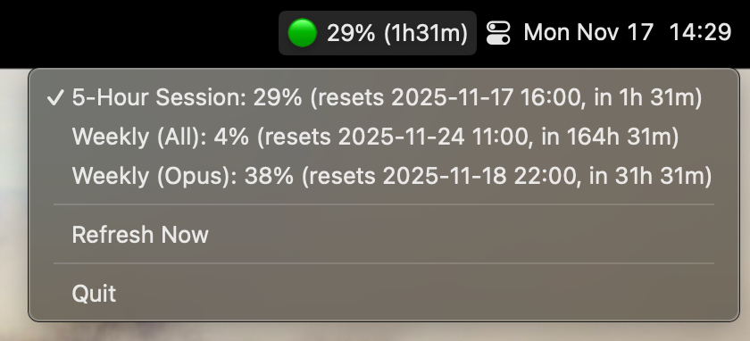
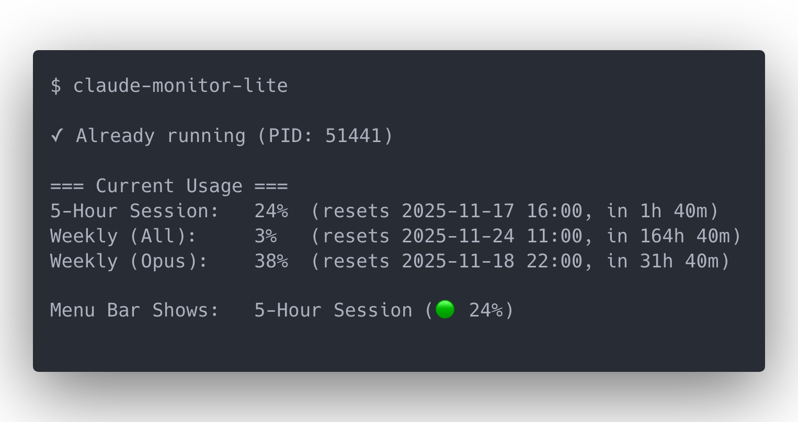

# Claude Monitor Lite

A lightweight menu bar monitor that displays **real-time rate limits** from your Claude account.



## Features

- Displays 5-hour session, weekly (all models), and weekly (Opus) usage limits
- Traffic light indicator: 🟢 Green (0-49%), 🟡 Yellow (50-79%), 🔴 Red (80%+)
- Auto-refresh every 30 seconds
- Requires Claude account

**Platform:** Tested on macOS. Other platforms not tested.

## Installation

```bash
# Homebrew
brew tap wickes1/tap
brew install --cask claude-monitor-lite

# Go
go install github.com/wickes1/claude-monitor-lite@latest
```

## Usage

```bash
claude-monitor-lite
```

**First run setup:**
1. Browser opens to claude.ai
2. Log in to your account
3. Open DevTools (F12 or Cmd+Option+I)
4. Navigate to: Application → Cookies → https://claude.ai
5. Copy the `sessionKey` value
6. Paste when prompted
7. Monitor starts and appears in your menu bar

**Already running:** The command shows current status.



**Switching metrics:** Click the menu bar icon to choose between 5-Hour Session, Weekly (All), or Weekly (Opus).

## Commands

```bash
claude-monitor-lite          # Start or show status
claude-monitor-lite stop     # Stop the monitor
claude-monitor-lite logout   # Clear session
```

## Troubleshooting

**Session expired:** Run `claude-monitor-lite logout` then restart.

**App not responding:** Run `killall claude-monitor-lite` then restart.
